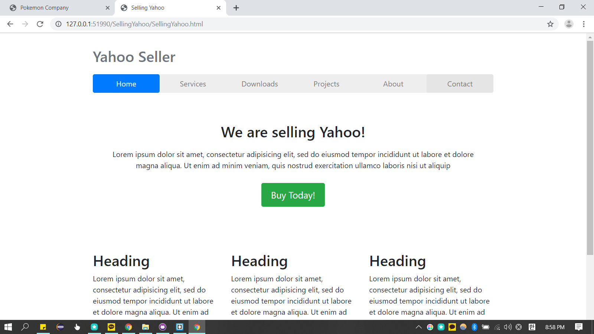

<h1>Complete-front-end-development</h1>
<h3>Naver Signup Page Project</h3>

<ul>
  <li><a href="https://miniminis.github.io/Complete-front-end-development/js/p01Naver/naverCheck.html">프로젝트 결과 화면 바로가기</a></li>
  <li><a href="https://github.com/Miniminis/Complete-front-end-development/tree/master/js/p01Naver">프로젝트 소스코드 바로가기</a></li>
</ul>

<h3>Facebook Login Page Project</h3>

<ul>
  <li><a href="https://miniminis.github.io/Complete-front-end-development/css/Facebook/c17Facebook.html">프로젝트 결과 화면 바로가기</a></li>
  <li><a href="https://github.com/Miniminis/Complete-front-end-development/tree/master/css/Facebook">프로젝트 소스코드 바로가기</a></li>
</ul>

<h3>Pokemon Company Mainpage Project</h3>

<ul>
  <li><a href="https://miniminis.github.io/Complete-front-end-development/Pokemon%20Company/index.html">프로젝트 결과 화면 바로가기</a></li>
  <li><a href="https://github.com/Miniminis/Complete-front-end-development/tree/master/Pokemon%20Company">프로젝트 소스코드 바로가기</a></li>
</ul>

<h3>Selling Yahoo Mainpage Project</h3>

<ul>
  <li><a href="https://miniminis.github.io/Complete-front-end-development/SellingYahoo/SellingYahoo.html">프로젝트 결과 화면 바로가기</a></li>
  <li><a href="https://github.com/Miniminis/Complete-front-end-development/tree/master/SellingYahoo">프로젝트 소스코드 바로가기</a></li>
</ul>

<h3>Techcompany Landing Page Project</h3>

<ul>
  <li><a href="https://miniminis.github.io/Complete-front-end-development/techLandingpageProject/techLanding.html">프로젝트 결과 화면 바로가기</a></li>
  <li><a href="https://github.com/Miniminis/Complete-front-end-development/tree/master/techLandingpageProject">프로젝트 소스코드 바로가기</a></li>
</ul>

